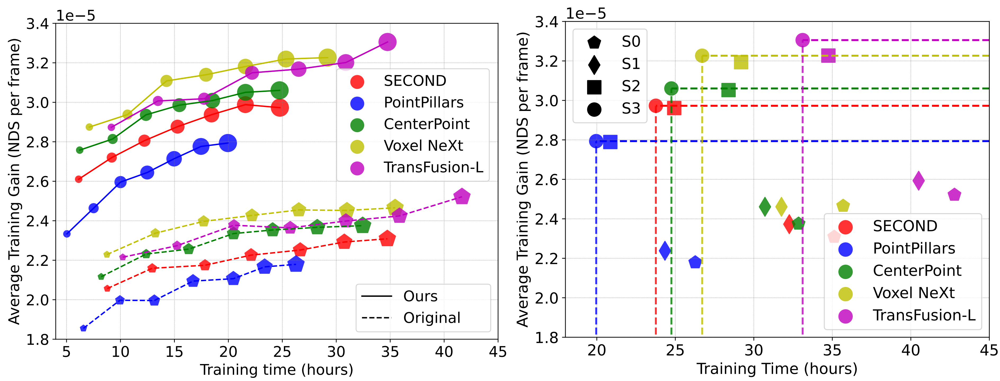

# Optimizing Autonomous Driving Datasets: Complexity, Quality, Uncertainty



> **Left**: the average training gain (nuScenes detection score per frame) of the retrained perception algorithms by the original and optimized nuScenes, which are tested on the validation set of the original nuScenes. **Right**: the Pareto front of the retrained perception algorithms by the original dataset ($D_{S_0}$) and the optimized datasets at each layer ($D_{S_1}, D_{S_2}, D_{S_3}$) of our method from training time and average training gain per frame. The retrained algorithms by $D_{S_3}$ dominate the others.

<details>
  <summary>Table of Contents</summary>
  <ol>
    <li>
      <a href="#about">About</a>
    </li>
    <li>
      <a href="#getting-started">Getting Started</a>
      <ul>
        <li><a href="#prerequisites">Prerequisites</a></li>
        <li><a href="#installation">Installation</a></li>
      </ul>
    </li>
    <li><a href="#usage">Usage</a></li>
    <li><a href="#zoo">Zoo</a></li>
    <li><a href="#contribution">Contribution</a></li>
    <li><a href="#license">License</a></li>
    <li><a href="#contact">Contact</a></li>
    <li><a href="#acknowledgments">Acknowledgments</a></li>
    <li><a href="#citation">Citation</a></li>
    <li><a href="#todo-list">Todo List</a></li>
  </ol>
</details>

## About

This is the project OpAdDatasets (optimizing autonomous driving datasets) based on complexity, quality, and uncertainty. Baes on the three features, it removes the redundant and low-quality 3D point cloud data frames to obtain a sub-dataset in smaller sizes and equivalent effectiveness.

## Getting Started

### Prerequisites

- Ubuntu 20.04/22.04
- Python 3.8
- Cuda 11.3/11.6/11.7
- Pytorch 1.12/1.13/2.0

### Installation

To start from data collecting, follow the full steps. If only the open source dataset is used, skip the two optional steps. But first create environment.
``` shell
conda create -n OptAdDatasets python=3.8
```

#### CARLA Simulator (optional)

Choose one of the two CARLA versions to install, the official version is recommended.

1. Download the official [CARLA version](https://github.com/carla-simulator/carla/releases/tag/0.9.15/), and following the official installation [tutorial](https://carla.readthedocs.io/en/0.9.15/start_quickstart/).
2. Download the specified [CARLA version](http://gofile.me/6MDrn/UOvykgikS). The newest version is here ([BaiduCloud](https://pan.baidu.com/share/init?surl=iLcAsa1yJSYNcisP1ymfow&pwd=b5au) | [GoogleDrive](https://drive.google.com/file/d/1kHZM-gMMSq9b4UvzKXK5PkzfXLoXZmkx/view)).

#### Active Data Collecting Tool (optional)

1. Clone the collecting tool

``` shell
mkdir ./collecting_tool & cd ./collecting_tool
git clone https://github.com/Kazawaryu/CARLA_ADA.git
```

2. Install requirements

``` shell
conda activate OptAdDatasets
pip install -r requirements.txt
```

#### Data optimization Tool
1. Install requirements
``` shell
cd ./optimizing_tool
conda activate OptAdDatasets
pip install -r requirements.txt
```
#### Training Platform

##### OpenPCDet
1. Clone the repository
``` shell
mkdir ./training_tool & cd ./training_tool
git clone https://github.com/open-mmlab/OpenPCDet.git
cd OpenPCDet
```
2. Install requirements
``` shell
conda activate OptAdDatasets
conda install pytorch torchvision -c pytorch # check your version
pip install -r requirements.txt
pip install av2, kornia==0.5.8, open3d, spconv
```
3. Compile
``` shell
python setup.py develop
```
    
##### MMDetection3D
1. Clone the repository
``` shell
mkdir ./training_tool & cd ./training_tool
git clone https://github.com/open-mmlab/mmdetection3d.git
cd mmdetection3d
```
2. Install requirements
``` shell
pip install -U openmim
mim install mmengine, 'mmcv>=2.0.0rc4', 'mmdet>=3.0.0'
pip install -v -e .
```

## Usage

### Collecting Datasets form CARLA

### Optimizing Datasets

### Traning Models

## Zoo

### Dataset Zoo

### Model Zoo


> The visualization of the performance of classic 3D perception models in autonomous driving, which are [Voxel NeXt](https://github.com/dvlab-research/VoxelNeXt), [TransFusion-L](https://github.com/XuyangBai/TransFusion), [CenterPoint](https://github.com/tianweiy/CenterPoint), and [SECOND](https://github.com/traveller59/second.pytorch?tab=readme-ov-file) retrained on the original dataset $D_{S_0}$ and optimized dataset $D_{S_3}$, respectively.

## Contribution

<a href="https://github.com/Kazawaryu/OptAdDatasets/graphs/contributors">
  
</a>

## Acknowledgments

- [CARLA Simulator](https://carla.org/)
- [CARLA Ros Bridge](https://github.com/carla-simulator/ros-bridge)
- [CARLA_INVS](https://github.com/zijianzhang/CARLA_INVS)

## Citation

```bib
comming soon
```

## Todo List

- [ ] Readme
- [ ] Collecting tools
- [ ] Optimization tools
- [ ] Training tools
